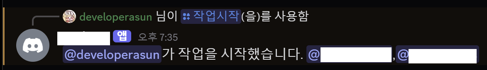

# botbot

A Discord bot to check in for daily work session.

<div align="center">



</div>

Study, coding, gym... you name it.

## run

create discord app and issue bot token. this is done on developer side, independently.

and then fill `.run.env`.

```sh
SERVER_ID=""
DISCORD_BOT_TOKEN=""
MEMBER_IDS=""
CHANNEL_ID=""
```

in local development,

```sh
go run main.go
```

to run the bot, build the image.

```sh
docker build -t botbot-discord:latest .
```

and then in terminal,

```sh
docker
./docker.run.sh SERVER_ID DISCORD_BOT_TOKEN MEMBER_IDS CHANNEL_ID
```

or just build executable with go build.

If you prefer to deploy on docker swarm, run below command. But note that this yaml and env setup is tailored to my personal on-premise server.

```sh
./deploy.sh
```

## tmi

+80% of `main.go` codes written by chatgpt.

## license

MIT.
